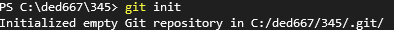
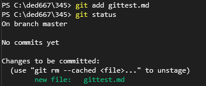
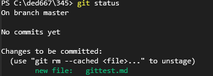
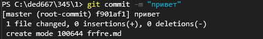
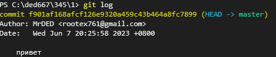

### Что такое Git?
Git - это одна из реализаций распределённых 
контроля версий, имеющая как и локальные, так и удалённые репозитория!
*********************************************************************
**                    Основные команды Git.                        **
*********************************************************************
# 1. Создания рипозитория
Git init - создания локального репозитория 

# 2. Добавления изменений в коммит
Git add - добавляет изменение из рабочего каталога в раздел проиндексированных файлов
пример: git add (имя файла) 

# 3. Просмотр состояния репозитория 
git status - команда нужна для просмотра состояния репозитория 

# 4. Создания коммитов
git commit - это команда для записи индексированных
изменений в репозиторий Git

# 5. Вывод на экран истории всех коммитов с их хэш-кодами
git log - отображает отправленные снимки состояния и
позволяет просматривать историю проекта

# 6. Изменение текста последнего коммита
git commit --amend -m <текст>
# 7. Создания ветки
git branch (названия ветки) 
# 8. Посмотреть список веток в репозитории
git branch

# 9. Создания новой ветки и переход
git checkout -b

# 10. Переход к другой ветке
git checkout <название ветки>
# 11. Клонирование внешнего репозитория на  локальный ПК  
git clone <url-адрес репозитория>
# 12. Получение изменений и слияние с локальной версией
git pull
# 13. Отправляет локальную версию репозитория на внешний
git push